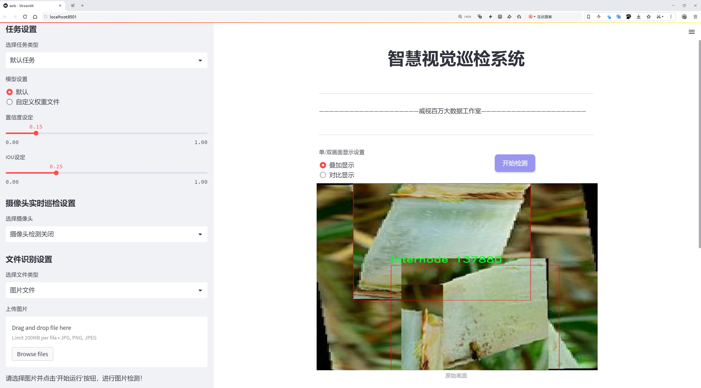

# 甘蔗茎节检测检测系统源码分享
 # [一条龙教学YOLOV8标注好的数据集一键训练_70+全套改进创新点发刊_Web前端展示]

### 1.研究背景与意义

项目参考[AAAI Association for the Advancement of Artificial Intelligence](https://gitee.com/qunmasj/projects)

项目来源[AACV Association for the Advancement of Computer Vision](https://kdocs.cn/l/cszuIiCKVNis)

研究背景与意义

随着全球人口的不断增长和对食品需求的日益增加，农业生产的效率和可持续性成为了各国政府和科研机构关注的重点。在这一背景下，精准农业作为一种新兴的农业管理理念，逐渐受到重视。精准农业依赖于高效的数据采集和分析技术，以实现对作物生长状态的实时监测和管理。甘蔗作为重要的经济作物，其生长过程中的各个环节都对最终的产量和质量产生重要影响。因此，开发高效的甘蔗生长监测系统，对于提高甘蔗的产量和品质具有重要的实际意义。

在甘蔗的生长过程中，茎节的发育情况直接影响到甘蔗的生长势和糖分积累。传统的人工监测方法不仅耗时耗力，而且容易受到人为因素的影响，导致数据的准确性和可靠性降低。因此，基于计算机视觉和深度学习技术的自动化检测系统应运而生。YOLO（You Only Look Once）系列算法因其高效的实时检测能力，已成为目标检测领域的热门选择。YOLOv8作为该系列的最新版本，具备更强的特征提取能力和更快的推理速度，适合于复杂环境下的目标检测任务。

本研究旨在基于改进的YOLOv8算法，构建一个高效的甘蔗茎节检测系统。通过对2100张甘蔗茎节图像的训练，系统将能够自动识别和定位甘蔗的茎节，进而为甘蔗的生长监测提供科学依据。该数据集的构建不仅为模型的训练提供了丰富的样本，还为后续的模型优化和性能评估奠定了基础。值得注意的是，甘蔗茎节的检测不仅涉及到目标的识别，还需要考虑到环境因素对检测结果的影响，如光照变化、背景杂乱等。因此，改进YOLOv8算法的关键在于如何增强模型的鲁棒性和适应性，以确保在各种复杂条件下都能保持较高的检测精度。

本研究的意义不仅在于技术层面的创新，更在于推动精准农业的发展。通过实现甘蔗茎节的自动检测，农民可以更及时地掌握甘蔗的生长状况，从而制定更科学的管理措施，提升甘蔗的产量和质量。此外，该系统的成功应用也为其他作物的生长监测提供了借鉴，具有广泛的推广价值和应用前景。

综上所述，基于改进YOLOv8的甘蔗茎节检测系统的研究，不仅具有重要的理论价值，也具有显著的实际应用意义。通过本研究的开展，将为甘蔗生产的智能化、精准化管理提供新的思路和方法，助力农业现代化进程的推进。

### 2.图片演示




##### 注意：由于此博客编辑较早，上面“2.图片演示”和“3.视频演示”展示的系统图片或者视频可能为老版本，新版本在老版本的基础上升级如下：（实际效果以升级的新版本为准）

  （1）适配了YOLOV8的“目标检测”模型和“实例分割”模型，通过加载相应的权重（.pt）文件即可自适应加载模型。

  （2）支持“图片识别”、“视频识别”、“摄像头实时识别”三种识别模式。

  （3）支持“图片识别”、“视频识别”、“摄像头实时识别”三种识别结果保存导出，解决手动导出（容易卡顿出现爆内存）存在的问题，识别完自动保存结果并导出到tempDir中。

  （4）支持Web前端系统中的标题、背景图等自定义修改，后面提供修改教程。

  另外本项目提供训练的数据集和训练教程,暂不提供权重文件（best.pt）,需要您按照教程进行训练后实现图片演示和Web前端界面演示的效果。

### 3.视频演示

[3.1 视频演示](https://www.bilibili.com/video/BV1FJsreBEXh/)

### 4.数据集信息展示

##### 4.1 本项目数据集详细数据（类别数＆类别名）

nc: 1
names: ['internode']


##### 4.2 本项目数据集信息介绍

数据集信息展示

在本研究中，我们使用了名为“sugarcane stem”的数据集，以支持对甘蔗茎节的检测系统进行改进，特别是针对YOLOv8模型的训练和优化。该数据集专注于甘蔗茎节的特征提取与识别，旨在提升农业自动化和精准农业的应用效果。数据集的类别数量为1，具体类别为“internode”，即甘蔗的茎节部分。通过这一单一类别的专注，我们能够更深入地挖掘甘蔗茎节的形态特征与生长状态，为后续的检测算法提供更加精准的训练数据。

“sugarcane stem”数据集包含了大量高质量的图像，这些图像涵盖了不同生长阶段、不同环境条件下的甘蔗茎节。每张图像都经过精细标注，确保模型在训练过程中能够准确学习到甘蔗茎节的外观特征。这些图像不仅包括了正常生长的茎节，还涵盖了受病虫害影响的茎节样本，极大地丰富了数据集的多样性和复杂性，使得模型在面对实际应用时能够具备更强的鲁棒性。

在数据集的构建过程中，研究团队采取了多种采集方式，包括实地拍摄和实验室控制条件下的拍摄，以确保数据的全面性和代表性。通过这种方式，数据集能够涵盖不同的光照条件、角度和背景，增强了模型的泛化能力。此外，数据集还包含了不同生长环境下的甘蔗样本，如不同土壤类型、气候条件等，这为模型的训练提供了丰富的上下文信息，使其能够更好地适应实际应用场景。

在训练过程中，我们将“sugarcane stem”数据集与YOLOv8模型相结合，利用其强大的特征提取能力和实时检测性能，旨在实现对甘蔗茎节的高效识别。通过对数据集的深入分析与处理，我们可以优化模型的参数设置，调整网络结构，以提高检测的准确性和速度。同时，数据集的单一类别特性使得模型的训练过程更加集中，减少了多类别干扰的影响，从而使得甘蔗茎节的检测更加精准。

为了评估模型的性能，我们将使用标准的评价指标，如平均精度均值（mAP）和召回率等，对模型在“sugarcane stem”数据集上的表现进行全面分析。这一过程不仅有助于验证模型的有效性，还为后续的研究提供了重要的参考依据。

总之，“sugarcane stem”数据集在本研究中扮演了至关重要的角色。通过对该数据集的充分利用，我们期望能够推动甘蔗茎节检测技术的发展，为农业生产提供更为先进的技术支持，助力实现智能农业的愿景。


### 5.全套项目环境部署视频教程（零基础手把手教学）

[5.1 环境部署教程链接（零基础手把手教学）](https://www.ixigua.com/7404473917358506534?logTag=c807d0cbc21c0ef59de5)


[5.2 安装Python虚拟环境创建和依赖库安装视频教程链接（零基础手把手教学）](https://www.ixigua.com/7404474678003106304?logTag=1f1041108cd1f708b01a)

### 6.手把手YOLOV8训练视频教程（零基础小白有手就能学会）

[6.1 手把手YOLOV8训练视频教程（零基础小白有手就能学会）](https://www.ixigua.com/7404477157818401292?logTag=d31a2dfd1983c9668658)

### 7.70+种全套YOLOV8创新点代码加载调参视频教程（一键加载写好的改进模型的配置文件）

[7.1 70+种全套YOLOV8创新点代码加载调参视频教程（一键加载写好的改进模型的配置文件）](https://www.ixigua.com/7404478314661806627?logTag=29066f8288e3f4eea3a4)

### 8.70+种全套YOLOV8创新点原理讲解（非科班也可以轻松写刊发刊，V10版本正在科研待更新）

由于篇幅限制，每个创新点的具体原理讲解就不一一展开，具体见下列网址中的创新点对应子项目的技术原理博客网址【Blog】：


[8.1 70+种全套YOLOV8创新点原理讲解链接](https://gitee.com/qunmasj/good)

### 9.系统功能展示（检测对象为举例，实际内容以本项目数据集为准）

图9.1.系统支持检测结果表格显示

  图9.2.系统支持置信度和IOU阈值手动调节

  图9.3.系统支持自定义加载权重文件best.pt(需要你通过步骤5中训练获得)

  图9.4.系统支持摄像头实时识别

  图9.5.系统支持图片识别

  图9.6.系统支持视频识别

  图9.7.系统支持识别结果文件自动保存

  图9.8.系统支持Excel导出检测结果数据


### 10.原始YOLOV8算法原理

原始YOLOv8算法原理

YOLOv8算法是Ultralytics公司在2023年推出的最新版本，标志着YOLO系列目标检测模型的又一次重大进化。相较于之前的版本，YOLOv8在多个方面进行了优化与创新，旨在提升目标检测的准确性和速度，同时保持其易用性。YOLOv8的设计理念围绕着快速、准确和灵活展开，使其在各种计算机视觉任务中表现出色，包括目标检测、图像分割和图像分类。

YOLOv8的网络结构可以分为几个主要部分：输入层、主干网络（Backbone）、颈部（Neck）和头部（Head）。首先，在输入层，YOLOv8默认接受640x640像素的图像作为输入。然而，考虑到实际应用中图像的长宽比可能各异，YOLOv8采用了自适应图片缩放技术。这种方法通过将图像的长边按比例缩小到指定尺寸，然后对短边进行填充，尽量减少信息冗余，提升目标检测的速度和效率。此外，在训练过程中，YOLOv8引入了Mosaic图像增强技术，通过随机选择四张图像进行缩放和拼接，生成新的训练样本。这种增强方法有效地提高了模型的泛化能力，使其能够更好地适应不同的场景和目标。

在主干网络部分，YOLOv8对C3模块进行了重要的改进，采用了C2F模块。C2F模块借鉴了YOLOv7中的ELAN设计思想，增加了更多的梯度流分支，旨在在保证轻量化的同时，获取更丰富的特征信息。这种结构的变化不仅提升了模型的精度，还降低了延迟，增强了实时检测的能力。通过这种方式，YOLOv8能够更有效地提取图像中的特征，尤其是在复杂场景下，表现出更强的鲁棒性。

接下来，在颈部（Neck）部分，YOLOv8对特征融合的方式进行了优化。与YOLOv5相比，YOLOv8去除了两次上采样之前的1x1卷积连接层，直接对主干网络不同阶段输出的特征进行上采样。这一改进使得特征融合更加高效，减少了计算复杂度，同时提升了模型的整体性能。

YOLOv8的头部（Head）部分是其最大的创新之一。该部分从耦合头（Coupled-Head）转变为解耦头（Decoupled-Head），将检测和分类的卷积操作分开处理。具体而言，输入特征图首先通过两个1x1卷积模块进行降维，然后分别进行类别预测和边界框位置及IoU（交并比）预测。这种解耦设计使得模型在处理复杂场景时，能够更精准地识别目标，并提高了分类的准确性。

值得注意的是，YOLOv8摒弃了传统的Anchor-Based（基于锚框）方法，转而采用Anchor-Free（无锚框）的方法。这一创新使得目标检测不再依赖于预设的锚框，而是将目标检测转化为关键点检测。通过这种方式，YOLOv8能够在没有锚框约束的情况下，灵活地适应不同大小和形状的目标，显著提高了模型的泛化能力。此外，YOLOv8在损失函数的设计上也进行了优化，取消了对象性分支，采用了更为精确的损失计算方法，使得模型在训练和推理过程中能够快速聚焦于目标附近的区域，提升了检测的准确性。

YOLOv8的这些创新使其在COCOval2017数据集上的表现显著优于之前的版本。通过综合运用多种先进的技术，YOLOv8在目标检测、图像分割和图像分类等任务中展现出卓越的性能。它不仅在精度和速度上超越了所有已知模型，还在处理小目标和高分辨率图像方面表现出色，为计算机视觉领域带来了新的机遇。

总的来说，YOLOv8作为YOLO系列的最新成员，通过对网络结构的全面优化与创新，提升了目标检测的效率和准确性。其在输入处理、特征提取、特征融合及输出预测等各个环节的改进，使得YOLOv8在实际应用中能够更好地应对复杂的视觉任务，展现出强大的适应性和灵活性。随着YOLOv8的广泛应用，目标检测技术的未来将更加光明，为各类智能应用提供强有力的支持。


### 11.项目核心源码讲解（再也不用担心看不懂代码逻辑）

#### 11.1 ui.py

以下是对代码的核心部分进行保留和详细注释的版本：

```python
import sys
import subprocess

def run_script(script_path):
    """
    使用当前 Python 环境运行指定的脚本。

    Args:
        script_path (str): 要运行的脚本路径

    Returns:
        None
    """
    # 获取当前 Python 解释器的路径
    python_path = sys.executable

    # 构建运行命令，使用 streamlit 运行指定的脚本
    command = f'"{python_path}" -m streamlit run "{script_path}"'

    # 执行命令并等待其完成
    result = subprocess.run(command, shell=True)
    
    # 检查命令执行的返回码，0 表示成功，非0表示出错
    if result.returncode != 0:
        print("脚本运行出错。")

# 实例化并运行应用
if __name__ == "__main__":
    # 指定要运行的脚本路径
    script_path = "web.py"  # 假设脚本在当前目录下

    # 调用函数运行脚本
    run_script(script_path)
```

### 代码分析与注释：
1. **导入模块**：
   - `sys`：用于访问与 Python 解释器紧密相关的变量和函数。
   - `subprocess`：用于生成新进程、连接到它们的输入/输出/错误管道，并获得返回码。

2. **`run_script` 函数**：
   - 该函数接受一个脚本路径作为参数，并在当前 Python 环境中运行该脚本。
   - 使用 `sys.executable` 获取当前 Python 解释器的路径，以确保脚本在正确的环境中运行。
   - 构建一个命令字符串，使用 `streamlit` 运行指定的脚本。
   - 使用 `subprocess.run` 执行构建的命令，并等待其完成。
   - 检查返回码，如果返回码不为0，表示脚本运行出错，并打印错误信息。

3. **主程序块**：
   - 通过 `if __name__ == "__main__":` 确保只有在直接运行该脚本时才会执行以下代码。
   - 指定要运行的脚本路径（这里假设脚本名为 `web.py`）。
   - 调用 `run_script` 函数，传入脚本路径以执行该脚本。 

这样处理后，代码更加简洁，并且每个部分都有详细的中文注释，便于理解其功能和作用。

这个程序文件 `ui.py` 的主要功能是运行一个指定的 Python 脚本，具体来说是使用 Streamlit 框架来启动一个 Web 应用。程序的结构相对简单，主要包含了导入模块、定义函数以及执行主程序的逻辑。

首先，文件开头导入了几个必要的模块，包括 `sys`、`os` 和 `subprocess`。其中，`sys` 模块用于访问与 Python 解释器相关的变量和函数，`os` 模块提供了与操作系统交互的功能，而 `subprocess` 模块则用于创建新进程、连接到它们的输入/输出/错误管道，并获取它们的返回码。

接下来，程序定义了一个名为 `run_script` 的函数，该函数接受一个参数 `script_path`，表示要运行的脚本的路径。在函数内部，首先通过 `sys.executable` 获取当前 Python 解释器的路径。然后，构建一个命令字符串，使用 Streamlit 的命令行接口来运行指定的脚本。具体的命令格式是 `"{python_path}" -m streamlit run "{script_path}"`，其中 `{python_path}` 和 `{script_path}` 会被实际的路径替换。

函数接着使用 `subprocess.run` 方法来执行构建好的命令，并设置 `shell=True` 以便在 shell 中运行该命令。执行后，函数会检查返回码，如果返回码不为 0，表示脚本运行出错，程序会打印出相应的错误信息。

最后，在文件的主程序部分，使用 `if __name__ == "__main__":` 语句来确保只有在直接运行该文件时才会执行后面的代码。在这里，首先调用 `abs_path` 函数（假设这个函数是用来获取文件的绝对路径）来指定要运行的脚本路径 `web.py`。然后，调用之前定义的 `run_script` 函数来运行这个脚本。

总的来说，这个 `ui.py` 文件的功能是为运行一个基于 Streamlit 的 Web 应用提供了一个简单的接口，能够方便地启动指定的 Python 脚本。

#### 11.2 70+种YOLOv8算法改进源码大全和调试加载训练教程（非必要）\ultralytics\hub\utils.py

以下是代码中最核心的部分，并附上详细的中文注释：

```python
import requests
from ultralytics.utils import TQDM, TryExcept, __version__, ENVIRONMENT, SETTINGS, RANK, ONLINE

def requests_with_progress(method, url, **kwargs):
    """
    使用指定的方法和URL进行HTTP请求，并可选地显示进度条。

    参数:
        method (str): 要使用的HTTP方法（例如 'GET', 'POST'）。
        url (str): 要发送请求的URL。
        **kwargs (dict): 传递给底层 `requests.request` 函数的其他关键字参数。

    返回:
        (requests.Response): HTTP请求的响应对象。
    """
    progress = kwargs.pop('progress', False)  # 从kwargs中提取进度参数
    if not progress:
        return requests.request(method, url, **kwargs)  # 如果没有进度，直接发送请求

    # 如果需要显示进度条
    response = requests.request(method, url, stream=True, **kwargs)  # 以流的方式请求
    total = int(response.headers.get('content-length', 0) if isinstance(progress, bool) else progress)  # 获取总大小
    try:
        pbar = TQDM(total=total, unit='B', unit_scale=True, unit_divisor=1024)  # 初始化进度条
        for data in response.iter_content(chunk_size=1024):  # 按块读取内容
            pbar.update(len(data))  # 更新进度条
        pbar.close()  # 关闭进度条
    except requests.exceptions.ChunkedEncodingError:  # 处理连接中断的异常
        response.close()  # 关闭响应
    return response  # 返回响应对象

def smart_request(method, url, retry=3, timeout=30, thread=True, verbose=True, progress=False, **kwargs):
    """
    使用'requests'库进行HTTP请求，支持指数退避重试机制。

    参数:
        method (str): 请求使用的HTTP方法。
        url (str): 要请求的URL。
        retry (int, optional): 尝试重试的次数，默认为3。
        timeout (int, optional): 超时时间（秒），默认为30。
        thread (bool, optional): 是否在单独的线程中执行请求，默认为True。
        verbose (bool, optional): 是否在控制台打印信息，默认为True。
        progress (bool, optional): 是否在请求过程中显示进度条，默认为False。
        **kwargs (dict): 传递给请求函数的其他关键字参数。

    返回:
        (requests.Response): HTTP响应对象。
    """
    retry_codes = (408, 500)  # 仅对这些状态码进行重试

    @TryExcept(verbose=verbose)
    def func(func_method, func_url, **func_kwargs):
        """进行HTTP请求，支持重试和超时，带有可选的进度跟踪。"""
        r = None  # 响应对象
        t0 = time.time()  # 记录开始时间
        for i in range(retry + 1):
            if (time.time() - t0) > timeout:  # 超过超时时间则停止重试
                break
            r = requests_with_progress(func_method, func_url, **func_kwargs)  # 发起请求
            if r.status_code < 300:  # 如果状态码在2xx范围内，表示成功
                break
            # 处理错误信息
            try:
                m = r.json().get('message', 'No JSON message.')
            except AttributeError:
                m = 'Unable to read JSON.'
            if i == 0:  # 仅在第一次请求时打印信息
                if r.status_code in retry_codes:
                    m += f' Retrying {retry}x for {timeout}s.' if retry else ''
                if verbose:
                    LOGGER.warning(f'请求失败: {m} (状态码: {r.status_code})')
            time.sleep(2 ** i)  # 指数退避
        return r  # 返回响应对象

    args = method, url
    kwargs['progress'] = progress  # 将进度参数传递给函数
    if thread:
        threading.Thread(target=func, args=args, kwargs=kwargs, daemon=True).start()  # 在新线程中执行
    else:
        return func(*args, **kwargs)  # 在当前线程中执行请求
```

### 代码核心部分解释
1. **requests_with_progress**: 该函数用于发送HTTP请求，并在下载过程中显示进度条。它支持流式读取响应内容，并根据响应的内容长度更新进度条。

2. **smart_request**: 该函数用于发送HTTP请求，支持重试机制和超时设置。它可以在请求失败时根据特定的状态码进行重试，并在控制台输出相关信息。该函数还支持在单独的线程中执行请求，以避免阻塞主线程。

这两个函数是代码的核心部分，主要用于处理HTTP请求和响应，支持进度显示和错误处理。

这个程序文件是一个用于Ultralytics YOLO（You Only Look Once）算法的工具类，主要涉及到与网络请求、事件分析和环境检测相关的功能。文件中包含了一些导入的库和模块，主要用于处理文件路径、网络请求、线程等操作。

首先，文件定义了一些常量，例如API的根地址和网页根地址，这些地址用于与Ultralytics Hub进行交互。接着，定义了几个函数来处理网络请求。其中，`request_with_credentials`函数专门用于在Google Colab环境中进行带有凭证的AJAX请求，确保在Colab中能够正确地进行身份验证。

`requests_with_progress`函数则是一个通用的HTTP请求函数，支持显示下载进度条。它根据请求的响应头部内容长度来动态更新进度条，方便用户了解下载的进度。

`smart_request`函数则是一个更为复杂的请求处理函数，支持重试机制和超时设置。它会在请求失败时根据设定的重试次数和超时限制进行多次尝试，并且可以选择在单独的线程中执行请求，以避免阻塞主线程。该函数还可以根据请求的状态码进行不同的处理，比如处理速率限制等。

接下来，文件定义了一个`Events`类，用于收集匿名事件分析数据。该类在初始化时会设置一些基本的元数据，包括Python版本、安装方式等信息。它还会根据设置和环境条件决定是否启用事件收集功能。通过调用该类的实例，可以将新的事件添加到事件列表中，并在达到速率限制时发送这些事件到指定的URL。

最后，文件在末尾创建了`Events`类的一个实例，准备在后续的操作中使用。整体来看，这个文件为YOLO算法的使用提供了网络请求和事件分析的基础功能，便于开发者在使用YOLO时进行数据收集和处理。

#### 11.3 70+种YOLOv8算法改进源码大全和调试加载训练教程（非必要）\ultralytics\models\rtdetr\__init__.py

以下是代码中最核心的部分，并附上详细的中文注释：

```python
# 导入RTDETR模型类
from .model import RTDETR
# 导入RTDETR预测器类
from .predict import RTDETRPredictor
# 导入RTDETR验证器类
from .val import RTDETRValidator

# 定义模块的公开接口，指定可以被外部访问的类
__all__ = 'RTDETRPredictor', 'RTDETRValidator', 'RTDETR'
```

### 注释说明：
1. **导入模块**：
   - `from .model import RTDETR`：从当前包中导入`RTDETR`模型类，`RTDETR`是一个用于目标检测的模型。
   - `from .predict import RTDETRPredictor`：从当前包中导入`RTDETRPredictor`类，负责使用`RTDETR`模型进行预测。
   - `from .val import RTDETRValidator`：从当前包中导入`RTDETRValidator`类，负责对模型的性能进行验证。

2. **公开接口**：
   - `__all__`变量定义了当前模块中可以被外部访问的类。只有在`__all__`中列出的类，才能通过`from module import *`的方式被导入。这种做法有助于控制模块的可见性，避免不必要的内部实现被外部使用。

这个程序文件是一个Python模块的初始化文件，属于Ultralytics YOLO项目的一部分，具体是与RTDETR（Real-Time Detection Transformer）相关的功能模块。文件中首先包含了一条注释，说明了该项目使用的是AGPL-3.0许可证，意味着该代码是开源的，并且遵循相应的开源协议。

接下来，文件通过相对导入的方式引入了三个主要的类或功能：RTDETR、RTDETRPredictor和RTDETRValidator。这些类分别定义在同一目录下的不同文件中。RTDETR类通常是模型的核心实现，负责定义和训练检测模型；RTDETRPredictor类则用于进行预测，处理输入数据并返回模型的输出结果；RTDETRValidator类则用于验证模型的性能，通常在训练后评估模型的准确性和有效性。

最后，`__all__`变量定义了该模块的公共接口，指定了当使用`from module import *`语句时，哪些名称会被导入。在这里，`__all__`包含了三个类的名称，表明它们是该模块的主要功能部分，用户可以直接使用这些类而无需了解模块内部的实现细节。

总的来说，这个文件的主要作用是组织和导出与RTDETR相关的功能，使得其他模块或用户能够方便地使用这些功能。

#### 11.4 70+种YOLOv8算法改进源码大全和调试加载训练教程（非必要）\ultralytics\nn\backbone\convnextv2.py

以下是代码中最核心的部分，并附上详细的中文注释：

```python
import torch
import torch.nn as nn
import torch.nn.functional as F

class LayerNorm(nn.Module):
    """ 自定义的LayerNorm层，支持两种数据格式：channels_last（默认）和channels_first。
    channels_last对应输入形状为(batch_size, height, width, channels)，
    而channels_first对应输入形状为(batch_size, channels, height, width)。
    """
    def __init__(self, normalized_shape, eps=1e-6, data_format="channels_last"):
        super().__init__()
        # 权重和偏置参数
        self.weight = nn.Parameter(torch.ones(normalized_shape))
        self.bias = nn.Parameter(torch.zeros(normalized_shape))
        self.eps = eps
        self.data_format = data_format
        if self.data_format not in ["channels_last", "channels_first"]:
            raise NotImplementedError 
        self.normalized_shape = (normalized_shape, )
    
    def forward(self, x):
        # 根据数据格式选择不同的归一化方式
        if self.data_format == "channels_last":
            return F.layer_norm(x, self.normalized_shape, self.weight, self.bias, self.eps)
        elif self.data_format == "channels_first":
            u = x.mean(1, keepdim=True)  # 计算均值
            s = (x - u).pow(2).mean(1, keepdim=True)  # 计算方差
            x = (x - u) / torch.sqrt(s + self.eps)  # 标准化
            x = self.weight[:, None, None] * x + self.bias[:, None, None]  # 应用权重和偏置
            return x

class Block(nn.Module):
    """ ConvNeXtV2的基本块，包含深度可分离卷积、归一化、激活函数等。
    
    Args:
        dim (int): 输入通道数。
        drop_path (float): 随机深度率，默认值为0.0。
    """
    def __init__(self, dim, drop_path=0.):
        super().__init__()
        # 深度可分离卷积
        self.dwconv = nn.Conv2d(dim, dim, kernel_size=7, padding=3, groups=dim)
        self.norm = LayerNorm(dim, eps=1e-6)  # 归一化层
        self.pwconv1 = nn.Linear(dim, 4 * dim)  # 1x1卷积（用线性层实现）
        self.act = nn.GELU()  # 激活函数
        self.pwconv2 = nn.Linear(4 * dim, dim)  # 1x1卷积（用线性层实现）
        self.drop_path = nn.Identity() if drop_path <= 0. else DropPath(drop_path)  # 随机深度

    def forward(self, x):
        input = x  # 保存输入
        x = self.dwconv(x)  # 深度可分离卷积
        x = x.permute(0, 2, 3, 1)  # 调整维度顺序
        x = self.norm(x)  # 归一化
        x = self.pwconv1(x)  # 第一个1x1卷积
        x = self.act(x)  # 激活
        x = self.pwconv2(x)  # 第二个1x1卷积
        x = x.permute(0, 3, 1, 2)  # 恢复维度顺序
        x = input + self.drop_path(x)  # 残差连接
        return x

class ConvNeXtV2(nn.Module):
    """ ConvNeXt V2模型，包含多个特征分辨率阶段和残差块。
    
    Args:
        in_chans (int): 输入图像的通道数，默认值为3。
        num_classes (int): 分类头的类别数，默认值为1000。
        depths (tuple(int)): 每个阶段的块数，默认值为[3, 3, 9, 3]。
        dims (int): 每个阶段的特征维度，默认值为[96, 192, 384, 768]。
        drop_path_rate (float): 随机深度率，默认值为0。
    """
    def __init__(self, in_chans=3, num_classes=1000, 
                 depths=[3, 3, 9, 3], dims=[96, 192, 384, 768], 
                 drop_path_rate=0.):
        super().__init__()
        self.depths = depths
        self.downsample_layers = nn.ModuleList()  # 存储下采样层
        # 初始卷积层
        stem = nn.Sequential(
            nn.Conv2d(in_chans, dims[0], kernel_size=4, stride=4),
            LayerNorm(dims[0], eps=1e-6, data_format="channels_first")
        )
        self.downsample_layers.append(stem)
        # 添加下采样层
        for i in range(3):
            downsample_layer = nn.Sequential(
                    LayerNorm(dims[i], eps=1e-6, data_format="channels_first"),
                    nn.Conv2d(dims[i], dims[i+1], kernel_size=2, stride=2),
            )
            self.downsample_layers.append(downsample_layer)

        self.stages = nn.ModuleList()  # 存储特征分辨率阶段
        dp_rates = [x.item() for x in torch.linspace(0, drop_path_rate, sum(depths))] 
        cur = 0
        # 添加多个残差块
        for i in range(4):
            stage = nn.Sequential(
                *[Block(dim=dims[i], drop_path=dp_rates[cur + j]) for j in range(depths[i])]
            )
            self.stages.append(stage)
            cur += depths[i]

        self.norm = nn.LayerNorm(dims[-1], eps=1e-6)  # 最后的归一化层
        self.head = nn.Linear(dims[-1], num_classes)  # 分类头

    def forward(self, x):
        res = []  # 存储每个阶段的输出
        for i in range(4):
            x = self.downsample_layers[i](x)  # 下采样
            x = self.stages[i](x)  # 残差块处理
            res.append(x)  # 保存输出
        return res  # 返回所有阶段的输出
```

### 代码说明：
1. **LayerNorm**: 自定义的层归一化，支持不同的输入格式。
2. **Block**: ConvNeXtV2的基本构建块，包含深度可分离卷积、归一化、激活函数和残差连接。
3. **ConvNeXtV2**: 整个模型的定义，包含多个下采样层和特征分辨率阶段，最后通过线性层进行分类。

这个程序文件实现了ConvNeXt V2模型的结构，主要用于计算机视觉任务，特别是图像分类。文件中包含多个类和函数，下面对其进行逐步讲解。

首先，文件开头部分包含版权信息和导入必要的库，包括PyTorch和一些辅助函数。接着，定义了一个名为`LayerNorm`的类，该类实现了层归一化（Layer Normalization），支持两种数据格式：`channels_last`和`channels_first`。这意味着输入数据可以是形状为(batch_size, height, width, channels)或(batch_size, channels, height, width)的张量。`LayerNorm`的`forward`方法根据数据格式对输入进行归一化处理。

接下来是`GRN`类，它实现了全局响应归一化（Global Response Normalization）层。该层通过计算输入的L2范数并进行归一化，来增强模型的表达能力。`GRN`的`forward`方法计算输入的响应并进行归一化处理，最终返回经过调整的输出。

然后是`Block`类，代表ConvNeXt V2的基本构建块。它包含一个深度可分离卷积层、层归一化、点卷积（使用线性层实现）、激活函数（GELU）、GRN层和另一个点卷积层。`Block`的`forward`方法实现了这些操作，并通过残差连接将输入与输出相加，最后应用随机深度（Drop Path）技术。

`ConvNeXtV2`类是整个模型的主体，包含多个阶段和下采样层。构造函数中定义了输入通道数、分类头的类别数、每个阶段的块数和特征维度等参数。模型的初始层是一个卷积层和一个层归一化层，后续则是多个下采样层和特征提取阶段，每个阶段由多个`Block`组成。模型的`forward`方法依次通过下采样层和特征提取阶段处理输入，并将每个阶段的输出保存到列表中。

接下来，定义了一个`update_weight`函数，用于更新模型的权重。该函数会检查权重字典中的每个键是否在模型字典中，并且形状是否匹配，如果匹配则更新权重。

最后，文件中定义了一系列函数（如`convnextv2_atto`、`convnextv2_femto`等），这些函数用于创建不同规模的ConvNeXt V2模型，并可选择加载预训练权重。每个函数根据不同的深度和维度参数构建模型，并在提供权重时调用`update_weight`函数来加载权重。

总体而言，这个文件实现了ConvNeXt V2模型的结构和相关功能，适用于图像分类等任务，并提供了灵活的模型配置和权重加载机制。

#### 11.5 code\ultralytics\models\sam\modules\transformer.py

以下是代码中最核心的部分，并附上详细的中文注释：

```python
import math
import torch
from torch import Tensor, nn

class Attention(nn.Module):
    """一个注意力层，允许在投影到查询、键和值之后对嵌入的大小进行下采样。"""

    def __init__(self, embedding_dim: int, num_heads: int, downsample_rate: int = 1) -> None:
        """
        初始化注意力模型，设置给定的维度和参数。

        Args:
            embedding_dim (int): 输入嵌入的维度。
            num_heads (int): 注意力头的数量。
            downsample_rate (int, optional): 内部维度下采样的因子，默认为1。
        """
        super().__init__()
        self.embedding_dim = embedding_dim
        self.internal_dim = embedding_dim // downsample_rate  # 计算内部维度
        self.num_heads = num_heads
        assert self.internal_dim % num_heads == 0, "num_heads must divide embedding_dim."  # 确保num_heads能整除内部维度

        # 定义线性层用于查询、键和值的投影
        self.q_proj = nn.Linear(embedding_dim, self.internal_dim)
        self.k_proj = nn.Linear(embedding_dim, self.internal_dim)
        self.v_proj = nn.Linear(embedding_dim, self.internal_dim)
        self.out_proj = nn.Linear(self.internal_dim, embedding_dim)  # 输出投影层

    @staticmethod
    def _separate_heads(x: Tensor, num_heads: int) -> Tensor:
        """将输入张量分离为指定数量的注意力头。"""
        b, n, c = x.shape  # b: 批量大小, n: 序列长度, c: 特征维度
        x = x.reshape(b, n, num_heads, c // num_heads)  # 重新调整形状以分离头
        return x.transpose(1, 2)  # B x N_heads x N_tokens x C_per_head

    @staticmethod
    def _recombine_heads(x: Tensor) -> Tensor:
        """将分离的注意力头重新组合为一个张量。"""
        b, n_heads, n_tokens, c_per_head = x.shape
        x = x.transpose(1, 2)  # 转置以便于重新组合
        return x.reshape(b, n_tokens, n_heads * c_per_head)  # B x N_tokens x C

    def forward(self, q: Tensor, k: Tensor, v: Tensor) -> Tensor:
        """给定输入的查询、键和值张量，计算注意力输出。"""

        # 输入投影
        q = self.q_proj(q)  # 投影查询
        k = self.k_proj(k)  # 投影键
        v = self.v_proj(v)  # 投影值

        # 分离为多个头
        q = self._separate_heads(q, self.num_heads)
        k = self._separate_heads(k, self.num_heads)
        v = self._separate_heads(v, self.num_heads)

        # 计算注意力
        _, _, _, c_per_head = q.shape  # 获取每个头的特征维度
        attn = q @ k.permute(0, 1, 3, 2)  # 计算注意力得分
        attn = attn / math.sqrt(c_per_head)  # 缩放
        attn = torch.softmax(attn, dim=-1)  # 应用softmax以获得注意力权重

        # 获取输出
        out = attn @ v  # 计算加权值
        out = self._recombine_heads(out)  # 重新组合头
        return self.out_proj(out)  # 通过输出投影层
```

### 代码核心部分解释：
1. **Attention类**：这是一个实现注意力机制的类，包含了输入的查询、键和值的投影以及计算注意力的逻辑。
2. **初始化方法**：在初始化中定义了输入和输出的线性层，并确保注意力头的数量能够整除内部维度。
3. **分离和重新组合头**：这两个静态方法用于处理多头注意力机制，将输入张量分离成多个头，进行计算后再组合回去。
4. **前向传播方法**：实现了注意力计算的核心逻辑，包括输入的投影、注意力得分的计算、权重的应用以及最终输出的生成。

通过这个类，可以在深度学习模型中实现注意力机制，增强模型对输入信息的处理能力。

这个程序文件定义了一个名为 `TwoWayTransformer` 的神经网络模块，主要用于处理图像和查询点之间的双向注意力机制。它是一个专门的变换器解码器，能够同时关注输入图像和查询点，适用于目标检测、图像分割和点云处理等任务。

在 `TwoWayTransformer` 类的构造函数中，定义了一些重要的属性，包括变换器的层数（`depth`）、输入嵌入的通道维度（`embedding_dim`）、多头注意力的头数（`num_heads`）、MLP块的内部通道维度（`mlp_dim`）等。该类还创建了一个包含多个 `TwoWayAttentionBlock` 层的模块列表，这些层构成了变换器的主体结构。此外，还定义了一个最终的注意力层，用于将查询点的注意力应用到图像上，并使用层归一化来处理最终的查询。

在 `forward` 方法中，输入的图像嵌入和位置编码被展平并重新排列，以便进行后续处理。然后，准备查询和键，依次通过每个变换器层进行处理。最后，应用最终的注意力层，将查询点的注意力聚焦到图像上，并进行层归一化，返回处理后的查询和键。

`TwoWayAttentionBlock` 类实现了一个注意力块，包含自注意力和交叉注意力机制。该块由四个主要层组成：对稀疏输入的自注意力、稀疏输入对密集输入的交叉注意力、对稀疏输入的MLP块以及密集输入对稀疏输入的交叉注意力。在构造函数中，初始化了各个层，并设置了是否跳过第一层的位置信息编码。

在 `forward` 方法中，首先应用自注意力机制，然后是稀疏输入对密集输入的交叉注意力，接着是MLP块，最后是密集输入对稀疏输入的交叉注意力。每一步都进行了层归一化，以保持数值稳定性。

`Attention` 类定义了一个注意力层，允许在对查询、键和值进行投影后对嵌入进行下采样。构造函数中初始化了输入嵌入的维度、注意力头的数量以及下采样率。`forward` 方法计算给定查询、键和值的注意力输出，通过输入投影、分离头部、计算注意力和重组头部来实现。

整体来看，这个文件实现了一个复杂的双向变换器结构，能够有效地处理图像和查询点之间的关系，适用于多种计算机视觉任务。

#### 11.6 train.py

以下是经过简化和注释的核心代码部分，主要集中在 YOLO 检测模型的训练过程中：

```python
import random
import numpy as np
import torch.nn as nn
from ultralytics.data import build_dataloader, build_yolo_dataset
from ultralytics.engine.trainer import BaseTrainer
from ultralytics.models import yolo
from ultralytics.nn.tasks import DetectionModel
from ultralytics.utils import LOGGER, RANK
from ultralytics.utils.torch_utils import de_parallel, torch_distributed_zero_first

class DetectionTrainer(BaseTrainer):
    """
    基于检测模型的训练类，继承自 BaseTrainer。
    """

    def build_dataset(self, img_path, mode="train", batch=None):
        """
        构建 YOLO 数据集。

        参数:
            img_path (str): 图像文件夹的路径。
            mode (str): 模式，`train` 或 `val`，可以为每种模式自定义不同的数据增强。
            batch (int, optional): 批次大小，仅用于 `rect` 模式。默认为 None。
        """
        gs = max(int(de_parallel(self.model).stride.max() if self.model else 0), 32)  # 获取模型的最大步幅
        return build_yolo_dataset(self.args, img_path, batch, self.data, mode=mode, rect=mode == "val", stride=gs)

    def get_dataloader(self, dataset_path, batch_size=16, rank=0, mode="train"):
        """构建并返回数据加载器。"""
        assert mode in ["train", "val"]  # 确保模式有效
        with torch_distributed_zero_first(rank):  # 仅在 DDP 中初始化数据集 *.cache 一次
            dataset = self.build_dataset(dataset_path, mode, batch_size)  # 构建数据集
        shuffle = mode == "train"  # 训练模式下打乱数据
        workers = self.args.workers if mode == "train" else self.args.workers * 2  # 根据模式设置工作线程数
        return build_dataloader(dataset, batch_size, workers, shuffle, rank)  # 返回数据加载器

    def preprocess_batch(self, batch):
        """对图像批次进行预处理，包括缩放和转换为浮点数。"""
        batch["img"] = batch["img"].to(self.device, non_blocking=True).float() / 255  # 转换为浮点数并归一化
        if self.args.multi_scale:  # 如果启用多尺度
            imgs = batch["img"]
            sz = (
                random.randrange(self.args.imgsz * 0.5, self.args.imgsz * 1.5 + self.stride)
                // self.stride
                * self.stride
            )  # 随机选择新的图像大小
            sf = sz / max(imgs.shape[2:])  # 计算缩放因子
            if sf != 1:
                ns = [
                    math.ceil(x * sf / self.stride) * self.stride for x in imgs.shape[2:]
                ]  # 计算新的形状
                imgs = nn.functional.interpolate(imgs, size=ns, mode="bilinear", align_corners=False)  # 调整图像大小
            batch["img"] = imgs  # 更新批次图像
        return batch

    def get_model(self, cfg=None, weights=None, verbose=True):
        """返回 YOLO 检测模型。"""
        model = DetectionModel(cfg, nc=self.data["nc"], verbose=verbose and RANK == -1)  # 创建检测模型
        if weights:
            model.load(weights)  # 加载权重
        return model

    def plot_training_samples(self, batch, ni):
        """绘制带有注释的训练样本。"""
        plot_images(
            images=batch["img"],
            batch_idx=batch["batch_idx"],
            cls=batch["cls"].squeeze(-1),
            bboxes=batch["bboxes"],
            paths=batch["im_file"],
            fname=self.save_dir / f"train_batch{ni}.jpg",
            on_plot=self.on_plot,
        )

    def plot_metrics(self):
        """从 CSV 文件中绘制指标。"""
        plot_results(file=self.csv, on_plot=self.on_plot)  # 保存结果图
```

### 代码注释说明：
1. **构建数据集**：`build_dataset` 方法用于根据给定的图像路径和模式（训练或验证）构建 YOLO 数据集。
2. **数据加载器**：`get_dataloader` 方法负责创建数据加载器，确保在分布式训练中只初始化一次数据集。
3. **预处理批次**：`preprocess_batch` 方法对输入的图像批次进行归一化和缩放处理，以适应模型的输入要求。
4. **获取模型**：`get_model` 方法用于创建并返回一个 YOLO 检测模型，可以选择性地加载预训练权重。
5. **绘制训练样本和指标**：`plot_training_samples` 和 `plot_metrics` 方法用于可视化训练过程中的样本和性能指标。

这个程序文件 `train.py` 是一个用于训练 YOLO（You Only Look Once）目标检测模型的 Python 脚本，主要依赖于 Ultralytics 提供的库。程序中定义了一个 `DetectionTrainer` 类，该类继承自 `BaseTrainer`，并实现了一系列与目标检测训练相关的方法。

在 `DetectionTrainer` 类中，首先定义了 `build_dataset` 方法，用于构建 YOLO 数据集。该方法接收图像路径、模式（训练或验证）和批次大小作为参数，并利用 `build_yolo_dataset` 函数生成数据集。它还根据模型的步幅（stride）来确定图像的处理方式。

接着，`get_dataloader` 方法用于构建并返回数据加载器。它会根据训练或验证模式来设置数据集的加载方式，并在分布式训练的情况下确保数据集只初始化一次。此方法还会处理数据加载时的打乱（shuffle）设置。

`preprocess_batch` 方法负责对图像批次进行预处理，包括将图像缩放到适当的大小并转换为浮点数格式。它支持多尺度训练，通过随机选择图像的大小来增强模型的鲁棒性。

`set_model_attributes` 方法用于设置模型的属性，包括类别数量和类别名称等。这些信息是从数据集中提取的，并被附加到模型中，以便于后续的训练和验证。

`get_model` 方法用于返回一个 YOLO 检测模型实例，可以选择加载预训练权重。该方法确保模型的类别数量与数据集一致。

`get_validator` 方法返回一个用于模型验证的 `DetectionValidator` 实例，该实例将用于评估模型在验证集上的表现。

`label_loss_items` 方法用于返回一个包含训练损失项的字典，这在目标检测中是必要的，因为需要跟踪不同类型的损失（如边界框损失、类别损失等）。

`progress_string` 方法返回一个格式化的字符串，显示训练进度，包括当前的轮次、GPU 内存使用情况、损失值、实例数量和图像大小等信息。

`plot_training_samples` 方法用于绘制训练样本及其标注信息，帮助可视化训练过程中的样本质量。

最后，`plot_metrics` 和 `plot_training_labels` 方法分别用于绘制训练过程中的指标和创建带有标签的训练图，以便于分析模型的性能和训练效果。

整体来看，这个文件提供了一个完整的训练框架，涵盖了数据集构建、数据加载、模型设置、训练过程监控和结果可视化等多个方面，适用于使用 YOLO 模型进行目标检测任务的开发和研究。

### 12.系统整体结构（节选）

### 整体功能和构架概括

该项目是一个基于YOLO（You Only Look Once）目标检测算法的实现，包含多个模块和工具，旨在提供一个完整的训练、验证和推理框架。项目的核心功能包括数据集构建、模型定义、训练过程管理、损失计算、可视化工具以及多种模型架构的实现（如RTDETR、ConvNeXt V2等）。整体架构通过模块化设计，使得各个部分可以独立开发和维护，同时也便于用户根据需求进行扩展和修改。

### 文件功能整理表

| 文件路径                                                                 | 功能描述                                                                                     |
|--------------------------------------------------------------------------|---------------------------------------------------------------------------------------------|
| `ui.py`                                                                  | 提供一个接口以运行基于Streamlit的Web应用，方便用户启动和使用YOLO模型。                     |
| `70+种YOLOv8算法改进源码大全和调试加载训练教程（非必要）\ultralytics\hub\utils.py` | 提供网络请求和事件分析功能，支持与Ultralytics Hub进行交互。                                  |
| `70+种YOLOv8算法改进源码大全和调试加载训练教程（非必要）\ultralytics\models\rtdetr\__init__.py` | 定义RTDETR模型的结构和接口，便于用户使用和扩展该模型。                                      |
| `70+种YOLOv8算法改进源码大全和调试加载训练教程（非必要）\ultralytics\nn\backbone\convnextv2.py` | 实现ConvNeXt V2模型的结构，支持图像分类等任务。                                            |
| `code\ultralytics\models\sam\modules\transformer.py`                    | 实现双向变换器结构，处理图像和查询点之间的关系，适用于目标检测和图像分割任务。               |
| `train.py`                                                              | 提供训练YOLO模型的框架，包括数据集构建、模型设置、训练过程监控和结果可视化等功能。        |
| `70+种YOLOv8算法改进源码大全和调试加载训练教程（非必要）\ultralytics\nn\extra_modules\kernel_warehouse.py` | 提供额外的模块和功能，可能用于特定的模型或任务，具体功能需进一步分析。                     |
| `code\model.py`                                                         | 定义模型的基本结构和功能，可能包含不同模型的组合和调用接口。                                |
| `70+种YOLOv8算法改进源码大全和调试加载训练教程（非必要）\ultralytics\models\nas\__init__.py` | 定义神经架构搜索（NAS）相关的模型和功能，便于用户进行模型优化和选择。                      |
| `code\ultralytics\utils\instance.py`                                    | 提供与实例相关的工具函数，可能用于处理数据实例和模型实例化。                               |
| `70+种YOLOv8算法改进源码大全和调试加载训练教程（非必要）\ultralytics\utils\callbacks\dvc.py` | 实现与数据版本控制（DVC）相关的回调功能，支持模型训练过程中的数据管理。                   |
| `70+种YOLOv8算法改进源码大全和调试加载训练教程（非必要）\ultralytics\utils\instance.py` | 提供与实例相关的工具函数，可能用于处理数据实例和模型实例化（重复，可能需要合并）。       |
| `code\ultralytics\utils\tal.py`                                        | 提供与目标检测和图像处理相关的工具函数，可能用于数据增强、后处理等功能。                   |

这个表格概述了每个文件的主要功能，帮助理解整个项目的结构和各个模块之间的关系。

注意：由于此博客编辑较早，上面“11.项目核心源码讲解（再也不用担心看不懂代码逻辑）”中部分代码可能会优化升级，仅供参考学习，完整“训练源码”、“Web前端界面”和“70+种创新点源码”以“13.完整训练+Web前端界面+70+种创新点源码、数据集获取”的内容为准。

### 13.完整训练+Web前端界面+70+种创新点源码、数据集获取


# [下载链接：https://mbd.pub/o/bread/ZpuZl5ds](https://mbd.pub/o/bread/ZpuZl5ds)